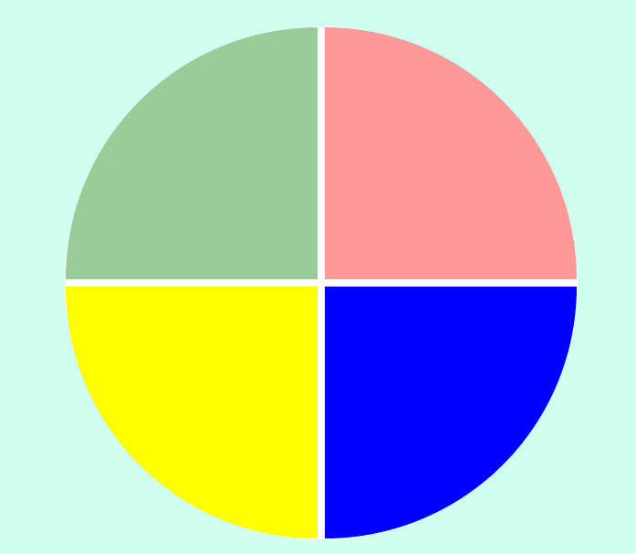

# **Criando seu jogo de memória estilo Genius**

## Projeto do Bootcamp JavaScript Game Developer na plataforma [Digital Innovation One](https://digitalinnovation.one/sign-up)

### Ministrado por: [Gabriela Pinheiro](https://www.linkedin.com/in/gabrielapinheiro129/)

### **Objetivo**
Criar um jogo Genius utilizando apenas HTML5, CSS3 e introduzindo a linguagem Javascript.

### **Conceitos Abordados**
- CSS Grid. 
- Manipulação de Array.
- Arrow Functions.

### **Tecnologias Utilizadas**
- Visual Studio Code:
    - Live Server.
- Navegador.

### **Resultado Final**

